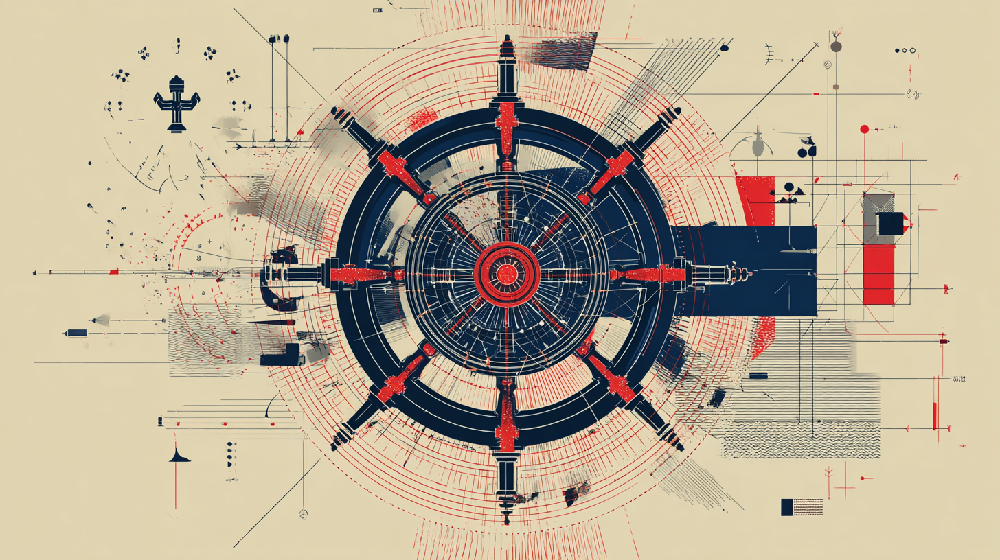
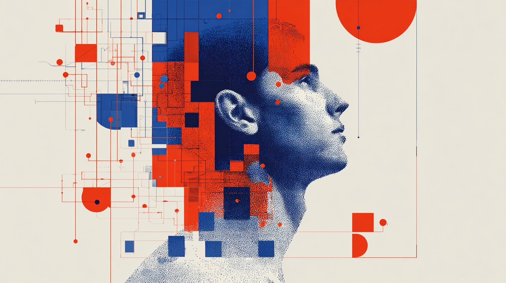
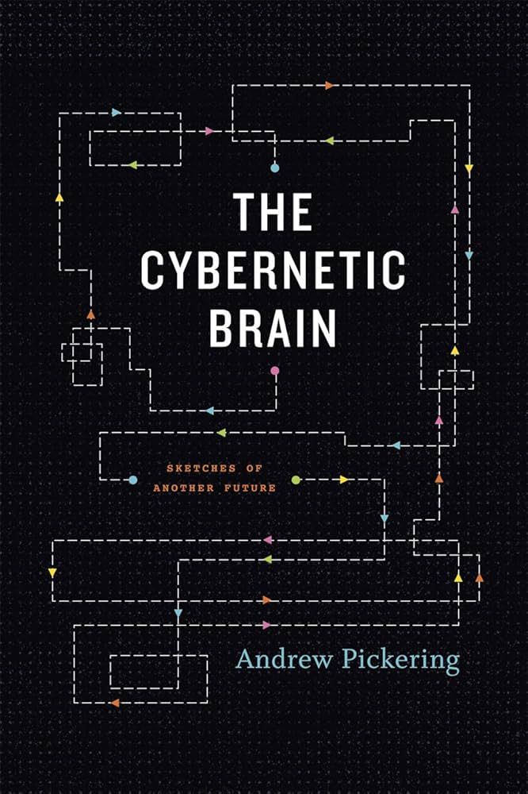
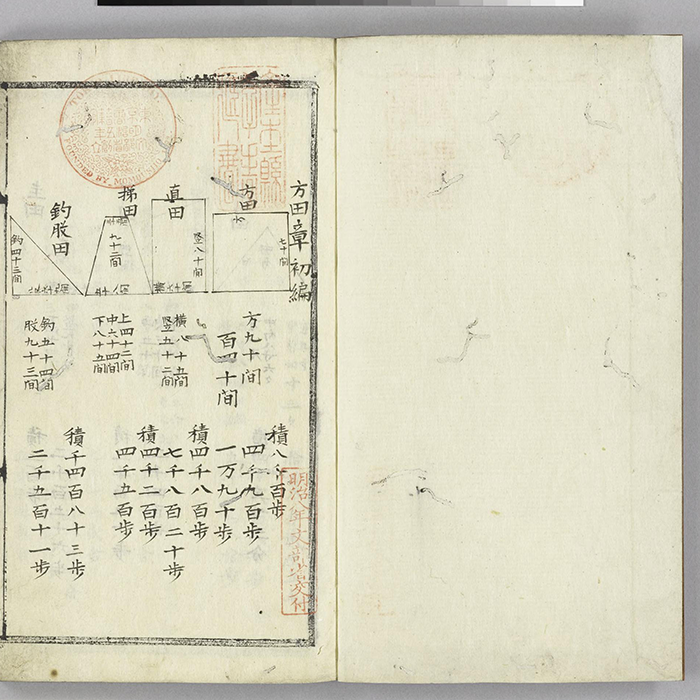
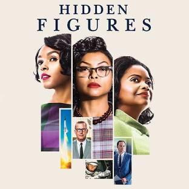
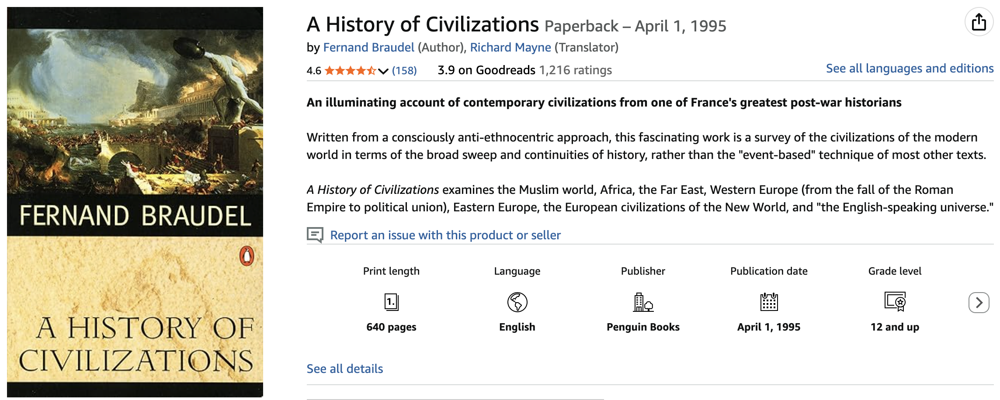
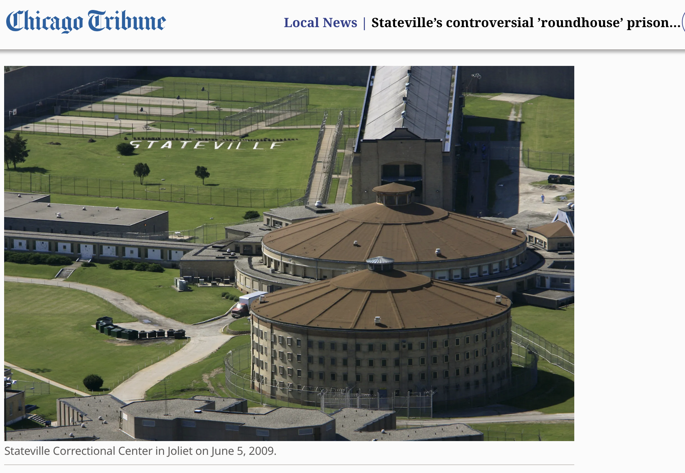

# Gen AI - Week 2 - Pathways to AI


---

## Today's Structure 

 - Lecture on (the conception of) history of AI
 - Discussion & summary of weekly articles
 - Practice: Choose and apply an AI to build an "artefact"

Warning: lot of content this week (and next). Will focus more on practice & discussion from week 4 onward.

---

## Assessments

Week 2 - due next Sunday

Reminder: **what about the history of AI has interested you? Are you surprised with where things have arrived at? What is it you feel most needs saying about AI today?**

Final assessment: Start thinking about areas to focus on: what is the problem, challenge, or opportunity you want to address?

Email me (lmagee@illinois.edu) with questions as we go. (insert link to Slack - no professors allowed!)


---

### First Definition (1955): Artificial Intelligence involves….  

| |
|---|
| “*how to make machines use language, form abstractions and concepts, solve kinds of problems now reserved for humans, and improve themselves*” (McCarthy et al., 1955) | 

---

### Themes: Cybernetics vs Artificial Intelligence?

| Cybernetics | AI |
|---|---|
|  |  |
| Norbert Weiner | John McCarthy |
| Cybernetics | Artificial Intelligence |
| Vision: Humans teaming with Machines (Cyborg) | Vision: A Machine Reproducing Human Intelligence |
| Collective | Individualized |
| Co-operative | Competitive |
| Directing (Governance) | "Self-improving" |
| "Cybernetics" - too fancy, academic; what does it even mean? | "Artificial Intelligence" - appeals to military / government / corporate funders |
| Cyber-social (Cope & Kalantzis 2022) | OpenAI |


---

### *Roman-tech-ism*? Melancholic Echoes of Cybernetics Today? 

 - Pro-tech, but attempting to reclaim its more "human" form
 - An Era of Symbiotic (or Sympoetic / Co-intelligent / Cyber-social) Pedagogy?
 - Who "owns" the discourse around AI? Ongoing tension between boosterism, doomerism and a (more obscure) third way - "romantechism"

| | | |
|---|---|---|
| Andrew Pickering (2010) *The Cybernetic Brain* | Donna Haraway (2016) *Staying with the Trouble* | Ethan Mollick (2024) *Co-intelligence* | 
|  | > |  | 

And I would add Anthropic's CEO, Dario Amodei, *Machines of Loving Grace*. Cope & Kalantzis? Goodlad & Stone? You decide.

```notes
Note an ongoing tension between boosterism, doomerism and a (more obscure) third way - "romantechism".
```

---

## Eurocentrism, Afro-Eurasian, New Worldism or Planetary AI?


| Afro-Eurasia | to the Arab world | to Europe |
| ---| --- | --- |
|  |   |  |
| China / India / Egypt / Ancient Greece  | *Proto-Computing in the 8th–13th Centuries - Al-Khwarizmi*  Esposito, John L. , ed. (1999) *The Oxford History of Islam*, Oxford University Press ISBN: 0195107993. ; April 2006. | Fourth Figure. *Ars brevis* XVIII Century. Palma de Mallorca BP MS998. Digital version Biblioteca Virtual del Patrimonio Bibliográfico. Spain. Ministerio de Educación, Cultura y Deporte.  |


```notes
Quick initial comment: history of computing and AI always seems dominated by Eurocentric (white, male) narrative. I'll be repeating some of these "sins" - with caveats - today, but want to stress that we need, for historical accuracy, to acknowledge the Afro-Eurasian 'continent', and indeed total planetary, contributions to this narrative. Ironically, for aspects of our critique in several weeks to be effective, we also must acknowledge the significance of the Eurocentric discourse about the automation of thought - while also acknowledging how this discourse is also connected practically with questions of colonial expansion: military, commercial, and governmental.

Consider how *late* the US is on the scene of AI - the foundations are laid out in Middle-east & Europe. We need to beware all *centrisms* - history moves on (and back - to China for example). 

```


---

## Side-note for the historically curious…

     Truitt, E. R. (2015). *Medieval robots: Mechanism, magic, nature, and art*. University of Pennsylvania Press.  

---

[An Archaeology of Artificial Intelligence](https://liammagee.github.io/rastersysteme/pages/ai-archaeology.html)

> Create an animated and interactive timeline of the history of AI, and its historical computational, mathematical, philosophical and literary antecedents

(and many more iterations)

1. Claude (and ChatGPT? Gemini) have this notion of "artefacts" - self-hosted apps which minimize the technical challenges of hosting.
2. Never mind the "perfect" prompt. Instead consider your skills as a teacher: ask question after question after question (Socratic method), until the AI *converges* on your desired goal. 

```notes
Side note: Example for final assessment. AI as conversational composer of history; layers of interaction. Will spend Week 4 practicing these approaches. 

A couple of points to note for now:

1. Claude (and ChatGPT? Gemini) have this notion of "artefacts" - self-hosted apps which minimize the technical challenges of hosting.
2. Never mind the "perfect" prompt. Instead consider your skills as a teacher: ask question after question after question (Socratic method), until the AI *converges* on your desired goal. 

```

   
---

## Heroic version of AI history ("Whiggish" history)

 - AI as the output of individual genius (Turing, von Neumann, McCarthy, Shannon, Minsky, Schmidhuber, LeCun, Hinton, Goodfellow, Sutskever etc).
 - Lots of fights: who came first? What is fundamental? What's a mistake?
 - Lots of language of "heros": "godfathers of AI" etc. Not necessarily wrong...
 - Paths not taken: deductive syllogisms vs inductive reasoning
 - Obscures "hidden figures" - women are nameless "computers" (an occupation), not inventors (though Ada Lovelace, Grace Hopper, Esther Dyson...). 



---

## “La Longue Duree” (Annales School, Fernand Braudel)

 - Concept of "Total History" - accumulating tendencies
   - Geological time
   - Social / economic time
   - Events
 - Braudel would like us to think of history as more than (a) the work of (heroic - typically white, male) individuals. Instead think: (b) processes, systems, structures, periods or "epistemes".
 - Side note: we think of things happening in countries. or perhaps continents. Braudel's history of the Mediterranean asks us to consider other geographical objects, like oceans. Also think of: Atlantic, Pacific or Indian oceans.
 



---

## AI as outcome of shifts in knowledge, techniques, instruments...

“The centre of knowledge, in the seventeenth and eighteenth centuries, is the **table**.” (Foucault, Michel. The Order of Things: An Archaeology of the Human Sciences. Trans. Alan Sheridan. New York: Vintage, 1973, 74.

 - Astronomy (Tycho Brahe - 16th century)
 - Human Mortality (John Graunt - 17th century)
 - Biology (Linnaeus)
 - Finance (double-book entry keeping)
 - Language (dictionaries, encyclopaedias)
 - Ballistics: "Firing Tables"

As we'll see, tables are also good memorizers for complex calculations.


---

## Sciences of the Human

 - What happens alongside these tables?
 - The natural sciences can predict phenomena (e.g. flight paths of stars, missiles)
 - What about sciences of the human? Are humans subject to laws? to Governance ("cybernetics")?
 - Need to manage populations at home (rise of democracy,  capitalism, policing) and abroad (colonization, military). 
   - institutions (the school, the clinic, the prison, the workplace)
   - paradoxically: democracy deepens the need to count (hence counting machines - systems of registration and control)
 - To *tabulate* is to *control* (and also be controlled - work can be checked). Forms of surveillance; architectural equivalent is the *panopticon*.



---

### Automating the Table: Developments in Steampunk "Big Data"

 - The Jacquard Loom (1800s) - first punchcards, "programming".
 - Babbage's "Difference Engine" (1830s) - improved tables.
 - Lovelace - general programmable machines (1842).
 - The typewriter (1860s). 
 - The tabulating machine (1890s).
 - The computer (1930s/40s).
 - The relational database (1960s/70s).
 - The spreadsheet (1970s/1980s).
 - Big Data (2000s).
 - AI (2010s/20s). 

---


| **17th/18th** Century | **19th Century** |
|---|---|
|  Final days of feudalism  | First days of industrial capitalism |
|  Computation as rational (human) | Computation as mechanical (machine) |
|  |    |

---

| Feudalism | Capitalism |
|---|---|
|  |  |
| **“The hand-mill gives you society with the feudal lord;** | **the steam-mill society with the industrial capitalist.” (Marx, 1847 ,*The Poverty of Philosophy*)** |


---


| 17th/18th C — Dawn of Modernity | 19th/Early 20th — Modernity Proper | Mid 20th–Early 21st — Post/Late Modernity |
|---|---|---|
| **Renaissance → Enlightenment Rationality** | **England as Factory of the World:** high-precision mass mechanization | **Politics & economics:** false “sciences” (two world wars, Great Depression) |
| **Mathematics:** Descartes, Leibniz, Newton | The horror of the machine — Romanticism, *Frankenstein*, the Gothic genre | **Paradox:** Computation arises from negative mathematics, 1930s (Gödel, Church, Turing) — what computation *cannot* do |
| **Science:** Bacon, Newton | **1820s** — Luddism, English Socialism | **First computers in WWII:** differencing engines (Leibniz, Babbage → ChatGPT) — calculus for missile trajectories |
| **Philosophy:** Descartes, Spinoza, Leibniz | **1830s/40s** — Babbage, Lovelace, Engels, Marx (Marx cited Babbage — Marxism as response to technology; “General Intellect” looks like AI) | **Post-war 1950s:** AI, cybernetics, information theory (Shannon), Turing test, game theory (Nash, von Neumann) — back to *”calculemus”*? |
| **Birth of the (Political) Subject:** Luther, Calvin → Descartes, Rousseau | **Comte:** Positivist sociology (society can be scientific) | **Markets as perfect computers:** neoliberalism as epistemology |
| *”Calculemus!”* (Let us Calculate — Leibniz) — but see Nietzsche’s reaction… | **Darwin:** Man is not the centre of things… (evolution orients towards history — perfectable or degenerative) | Post-Fordism, immaterial / flexibilized / cognitive labor |
| **Proto-Industrialization / Globalization / Colonization** | **Ricœur:** “Hermeneutics of Suspicion” (Marx, Nietzsche, Freud) — beyond Descartes: ideology / will to power / unconscious desire | **Counter-narratives:** Cultural Marxism, existentialism, poststructuralism; “ends” talk (Foucault, Fukuyama, Lyotard) |
| **Machines:** Steam Engine / Jacquard Loom | **Fordism / Taylorism** | Post-Enlightenment disenchantment. AI Winter / Spring / glorious Summer? Transhumanism, return to Enlightenment, or enshittification (Doctorow)? |


---

## Kate Crawford, *Atlas of AI*


‘If AI systems are seen as more reliable or rational than any human expert, able to take the “best possible action,” then it suggests that they should be trusted to make high-stakes decisions in health, education, and criminal justice. When specific algorithmic techniques are the sole focus, it suggests that only continual technical progress matters, with no consideration of the computational cost of those approaches and their far-reaching impacts on a planet under strain.  In contrast, in this book I argue that AI is **neither artificial nor intelligent**. Rather, artificial intelligence is both embodied and material, made from natural resources, fuel, human labor, infrastructures, logistics, histories, and classifications. AI systems are not autonomous, rational, or able to discern anything without extensive, computationally intensive training with large datasets or predefined rules and rewards. In fact, artificial intelligence as we know it depends entirely on a much wider set of political and social structures…. At a fundamental level, AI is **technical and social practices, institutions and infrastructures, politics and culture**. Computational reason and embodied work are deeply interlinked: AI systems both reflect and produce social relations and understandings of the world.’ Crawford, Kate. (2021). *Atlas of AI: Power, Politics, and the Planetary Costs of Artificial Intelligence* (p. 8). Yale University Press.     

---

## Women in Computing and Technology: From Frankenstein to "World's First Programmer"

- Romantic Poets: Percy Shelley, Lord Byron, John Keats
- Mary Shelley, wife of Percy: Author of *Frankenstein* - the **negative** effects of technology
- Byron's daughter: Ada Lovelace, author of *Note G*, the first program 
- Percy Shelley's

```notes
Early coincidence of romanticism and technological optimism.
```

---

## Cross-Domain Case Study: The "little stone" of AI

 - Newton / Leibniz: 17th century
 - Material / Mathematical foundations (But etymologically “small stone” - what a child uses to count with). 
 - Among first uses of computers in 1940s: ballistics
 - Fundamental to AI: backpropagation, learning the shape of a function (week 3)
 

     


---

People likely know the famous first examples of computers for solving decryption. A kind of "safe" version of the origins of computing: the Nazis, evil, encrypted messages, the Allies, good, decrypted them. Then onto IBM, Apple, Microsoft!

But what of their other use? Ballistics, missile trajectory...

---

## Drawing a Long Bow": From Ballistics to AI

 - Without drag - how do we calculate motion of an object?
 - Parabola - models a curved symmetrical movment. One time calculation using geometry, algebra and trigonometry (sine / cosine )
   - Can handle *gravity* - constant downward acceleration
   - **side question: what level mathematics?**
 - But what really happens? We throw a stone / launch a missile
   - Stones / arrows etc - looks like a Gallilean parabola   
   - Gunpowder - greater **velocity** means greater **drag** - less and less symmetrical
   - Acceleration changes every instant - requiring constant recalculation - usually no single neat "closed solution" - instead approximation
     - Break problem into little discrete arithmetic steps - what computers do
   

---

## Practice

[Early Ballistic Computer Simulation](https://liammagee.github.io/rastersysteme/pages/ballistic-computer-sim.html)

> Side note: "Make me a simple simulation that shows how the first computers were used to solve problems of derivatives for missiles" (Also bear in mind for assessment)


---

## Thought experiment: Throwing a Stone

So let's throw a stone; we have essentially (simplistically) 4 variables:
 - angle of release
 - velocity (metres/yards per second)
 - gravity (wants to pull the stone back to ground)
 - drag (air resistance; varies with velocity, meaning we need to **calculate as we go** - not an analytic solution)
 - So we now need fancy (17th century and beyond) math:
   - Euler's method (following Newton / Leibniz): decompose the entire stone's thrown into a sequence:
     - Step 1: x, y, velocity x, velocity y
     - Step 2: new x, new y -> then new velocity x, new velocity y
     - etc...

Can be done by hand, but each angle + velocity needs a new set of values...
New problems: mass, shape of stone (etc. etc)
 - Euler: 1760s
 - Runge–Kutta Corrections: 1890s/1900s
 - Initial computation: Euler method (1940s); Runge–Kutta (late 1940s/50s) ... 
 


---

## Education: following the arc of history

Now think about education as a parallael historical process. As society changes, so too does demand for labour and learning...

 - With gunpowder, for military purposes, we need trigonometry, calculus, physics, ordinary differential equations...
 - With democracies we need people (& machines) who can count and predict - arithmetic, statistics, probability, forecasting
 - With capitalism, we need accounting, projections, time series analysis, economic modelling, planning

Governmental, Industrial, Military uses: need a ready workforce of "calculaters", "computers", "coders".

Curriculum: shaped by the growing need to throw stones (and other applications of calculus)

Demands exceed the human "computers" (pre-1940s): a person calculating these trajectories (a "computer")

Then no longer just *how to compute* but also *how to build computers* (electrical engineering, hardware, software etc).


---

## For those mathematically / philosophically minded:

 - Much of AI-related - and general - computing from 1940s to 2020s involves mapping continuous (derivates) into discrete (very small differences). At least as far as *simulation* (from ballistics to language generation) are concerned.
 - Note *analog* (non digital) calculators can compute continuities directly! Arguably what biological brains also do - open for debate. 
 - Continuous > discrete is always "lossy" - loses definition. Think about how early pixels used RGB - so many values for red, green, blue. Detail, naunce is lost. Is digitization - conversion of continuous to discrete - an approximation but never realization of the real thing? (see interview with Yann LeCun next week). 


---

## AI in 2026: An Opinionated Take on the Present

What's going on in the world of AI today?


---

## AI Consolidation 

 - "Big Three": OpenAI's ChatGPT, Anthropic's Claude, Google's Gemini
   - Other big names have slowed down: Xai, Meta, Microsoft Copilot
   - Apple: using Google Gemini
   - Amazon: investor in Anthropic, provider for OpenAI
 - Shift from free / $20 per month to:
   - Advertising (ChatGPT)
   - Higher tier models ($200 per month)
   

---

## Rise of open source models

 - Mostly developed in China
   - Xiaomi
   - Alibaba Qwen
   - Kimi
   - Minimax
   - DeepSeek
 - Mistral (France)
 - Nemotron (Nvidia)
 - Estimated 3-9 months beyond commercial models
 - Issues around "benchmaxxing"; IP theft(!); hosting / exfiltration of data


---

## Contradictory tendencies: Increasing demand...

 - Scaling laws (Week 3)
 - Bigger models 
 - More "thinking" (inference) time
 - Huge investment data centers, power plants


---

## ...but also: 

 - More efficient GPUs (see Nvidia)
 - Better algorithms (especially from Chinese labs)
 - Better hardware (Apple): Open source models run locally

In Workshop 4 we'll be examining criticisms of the environmental and social costs of AI. As a note for now: these differing trends make long term estimation hard to predict.


---

## Agentive AI

 - Code automation
   - OpenAI Codex
   - Claude Code
   - Google Gemini
 - Computer use:
   - OpenClaw: local agent, social media for chatbots
   - Claude Cowork
 - Design:
   - Google Stitch, Nano Banana 2, Midjourney
   - Embedded tools in Adobe, Figma etc


---

## Education Issues: Cons

 - Plagiarism & Cognitive Offloading
 - Biased Results & Unequal Access
 - Potential Obsolescence of Teachers?
 - Perverse Effects: Automated Assignments > Automated Grading
   - Bernard Stiegler's *The Automatic Society*?
 - Subtle Changes: transfer of expertise from human to machine?


---

## Education Issues: Pros


 - Personalized, adaptive learning
 - Accessibility
 - Can support Universal Design for Learning
   - Attractive as a form of inclusive education
   - But expensive, time-consuming
   - Can AI generate multiple forms of engagement, representation, activities?

---

## However: "Bigger Picture" Issues

1. Predicted Erasure of White-Collar (Cognitive) Labor
   - Programming
   - Design
   - Games
   - Entry-level professions 
2. What happens When AI works properly? Social media as Harbinger: Addictive, Compulsive AI; AI "Psychosis"
3. Concentration of Power: Owners of AI; Power Users of AI; The rest of us?


---

## What do we need to learn now? What do we need to teach?

No easy answers:
 - "Core" Machine Learning? highly specialized (calculus, probability, linear algebra) 
 - "Prompt engineering"? But AI can write prompts...
 - Hardware? Again, specialized - traditionally male dominated
 - Services? 
   - plumbing, electrician - Jensen Huang - but what about robots?
   - Care industries? (hospitals, childcare, counselling)
 - Humanities? Peter Thiel...


---

## Crisis in Higher Ed

 - Spiralling costs
 - Increased distrust in "traditional" knowledge, expertise (the COVID effect? Mis/disinformation?)
 - Lack of effective pathways to professional, higher paid labor
 - Not yet, but anticipated (questions for weeks 5, 6, 7)
 


---

### Looking ahead…  

What **fundamentals** makes for AI / Machine Learning / Deep Learning / Neural network?

 - Calculus (17th century – Leibniz, Newton)

 - Probability [think “stochastic parrots”] (18th/19th century – Euler, Gauss, Laplanche Fourier)

 - Linear algebra (19th century – James John Sylvester)

 - Markov Models (very early 20th century – Andrej Markov)


---

### And a bold proposition…  


All the **mathematics** for AI in 2025 was developed by the end of the 19th century (with applications, like Markov models, in 1906/1913)

Are the last 125 years just **hardware**, **networks** & **data **(see LeCun 2021 - who doesn’t (quite) say this)?

Is our sense of **modernity **just the long shadow cast by the Enlightenment (17th / 18th century)?

---


## Discussion

Pick an article group
Try to balance
Discuss:
 - What stood out?
 - What was new?
 - What you agreed with / what you didn't?
 - What were its limitations?
 - Overall: what does this slice of the history of AI teach us about the present? 

**Add bullet points to weekly tabs**


---

Break!


---

## Report back

Overall: key points. 

---

## Practice Groups


1. Which AI tool (ChatGPT / Claude / Gemini)?
2. What is the best version available through the university / other means?
3. What is the *modality* of your use? 
   - Web front end (chatgpt etc) 
   - Desktop
   - CLI (command line interface)
4. Set up a "harness" for experimentation - choose a folder, and try a "1 shot" version of some aspect of the course
   - Imagine some web animation or interactive artefact
   - Pick a simple task: summarize this article, visualize the geography or history, etc.
5. For people used to this: how would you set up a loop that (a) creates an object (learning artefact); (b) evaluates it against criteria; (c) refines the object; (d) recursively iterates through that process until convergence with your idea?
    
---

## Assessment Questions?

---

## Next Week: The Technological Lens


Unpacking the Black Box?

Don't panic if next week's materials look complex...

[cgscholar.com](https://cgscholar.com/posts/1200?communityId=141)


<!---

---

## Case Study: *Geist* in the Machine (Magee 2026)

 - Geist in the Machine: Simulating Recognition and Inner Dialogue in AI-Mediated Teaching and Research - https://arxiv.org/abs/2603.10450
 - What is it? Experiment over winter to test (a) approaches to AI teaching and (b) developments in AI research 
 - Builds upon earlier work (*The Drama Machine*, The Drama Machine: Simulating Character Development with LLM Agents)


---

## Case Study: Key Concepts

 - *Vibe coding* (Karpathy)
 - Vibe scholarship?
   - Really: Vibe-then-validate: version 1.0 -> version 2.0
 - Centrality of *recognition* for self-consciousness (Hegel, 1807; Honneth 1996)
 - Importance of the *unconscious* (Freud 1923)
 - Rise of *nonconscious cognition* (Katherine Hayles 2017)
 - But **what happens when we *know* we are not recognized but we *feel* recognized by a machine**?
   - Nonconscious *re*cognition (Magee 2026)

---

## What AI can do for research

 - Generate prompts
 - Generate simulated dialogue
 - Generate rubrics for evaluation
 - Generate test harness to apply rubric to evaluate prompts and dialogue
 - Generate quantitative analysis of rubric scores (control vs experiment)
 - Generate qualitative analysis of dialogue (word frequencies, thematic analysis)
 - Generate **NONSENSE** - subtle bugs can percolate through to produce "theoretical results". Need to validate, iterate - still vital "human-in-the-loop" - *we* are the triangulation
 
-->

 