# Gen AI - Week 1 - Pathways to AI

### 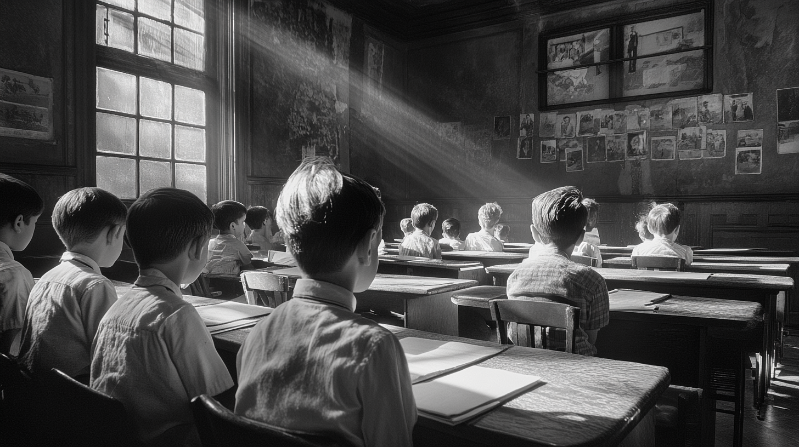  

| | |
|---|---|
| Generative AI for Education   |  |

---
## “La Longue Duree” (Annales School, Fernand Braudel)

 - "Total History"

 - Why it matters
   - Should we treat history as (a) the work of (heroic - typically white, male) individuals? Or (b) processes, systems, structures? 
 
 - Compare:
   - AI as the output of individual genius (Schmidhuber, LeCun, Hinton, Goodfellow, Sutskever etc)?

   - Or instead a process of accumulating layers:
     - Material / Mathematical foundations (calculus - 17th century - but etymologically “small stone” - what a child uses to count with). Fundamental to backpropagation, fundamental to machine learning - but a fundamentally simple operation repeated over and over.  
     - Development of statistics: again, 17th century, register of births, deaths and marriages. "Big data" in the era of pen and paper. Connection to government: control of the people via techniques of governance, governmentality (Foucault, *Les Mots et Les Choses* / *The Order of Things*). 
     - Colonization: how to control people at a distance. 
     - Rise of industralialization, modernization: accumulation and deployment of capital. Fixed vs variable costs: factories, rail. 
     - Early informatics: the printing press, the typewriter. Babbage's "Difference Engine" (1830s) 
  
  ---

     - The problem of curvature. “Old school” Euclidean geometry, trigonometry good for architecture, but doesn't help in a world of *motion*
     - Problems of astronomy, ship navigation - but still relatively limited influence of *drag*
     - Ballistics - force, resistance, shape of projectile, atmosphere: shift from stars, ships to missles
     -  limited help - until we “square the circle” - decompose curved trajectories into lots of tiny lines (derivatives) / rectangles (integrals). “Unlock” the possibilities of stars, balls - missiles. First uses of computing - calculate the derivates 
    
Instruction: Make me a simple simulation that shows how the first computers were used to solve problems of derivatives for missiles

---

##

People likely know the famous first examples of computers for solving decryption. A kind of "safe" version of the origins of computing: the Nazis, evil, encrypted messages, the Allies, good, decrypted them. Then onto IBM, Apple, Microsoft!

But what of their other use? Ballistics, missile trajectory...

---

Galileo (pre-Calculus!)

 - Parabola - models an curved but essentially consistent universe. One time calculation using sine / cosine / trigonometry (what year mathematics)?
   - Can handle *gravity* - constant downward force
 
 - But what really happens? We throw a stone / launch a missile
   - And drag - acceleration changes every instant - requiring constant recalculation
   
  

So let's throw stone; we have essentially (simplistically) 4 variables:
 - angle of release
 - velocity (metres/yards per second)
 - gravity (wants to pull the stone back to ground)
 - drag (air resistance; varies with velocity, meaning we need to **calculate as we go** - not an analytic solution)
 - So we now need fancy (17th century and beyond) math:
   - Euler's method (following Newton / Leibniz): decompose the entire stone's thrown into a sequence:
     - Step 1: x, y, velocity x, velocity y
     - Step 2: new x, new y -> then new velocity x, new velocity y
     - etc...

Can be done by hand, but each angle + velocity needs a new set of values...
New problems: mass, shape of stone (etc. etc)
 - Euler: 1760s
 - Runge–Kutta Corrections: 1890s/1900s
 - Initial computation: Euler method (1940s); Runge–Kutta (late 1940s/50s) ... 
 
 
Now think about education. For military purposes, we need trigonometry, calculus, physics, ordinary differential equations...
The "computer" pre-1940s: a person (typically woman) calculating these 

---

[claude.ai](https://claude.ai/public/artifacts/c8c048da-b0af-4ac8-befc-33faf70536a4)

---

[Early Ballistic Computer Simulation](https://liammagee.github.io/rastersysteme/pages/ballistic-computer-sim.html)

---

For those mathematically / philosophically minded:

 - Much of AI-related - and general - computing from 1940s to 2020s involves mapping continuous (derivates) into discrete (very small differences). At least as far as *simulation* (from ballistics to language generation) are concerned.
 - Note *analog* (non digital) calculators can compute continuities directly! Arguably what biological brains also do - open for debate. 
 - Continuous > discrete is always "lossy" - loses definition. Think about how early pixels used RGB - so many values for red, green, blue. Detail, naunce is lost. Is digitization - conversion of continuous to discrete - an approximation but never realization of the real thing?

 

---

### Cybernetics   Artificial Intelligence  

| | |
|---|---|
| 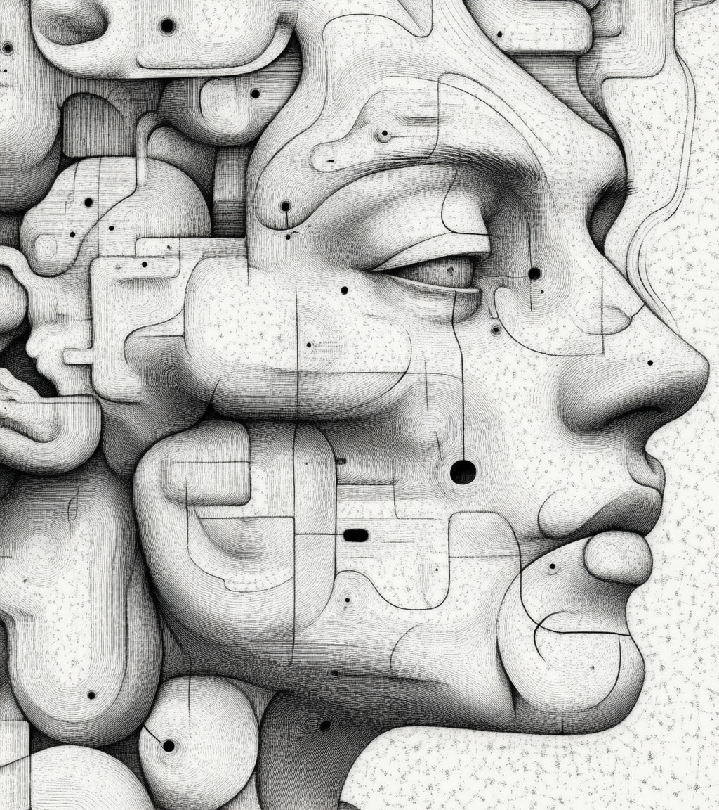   | 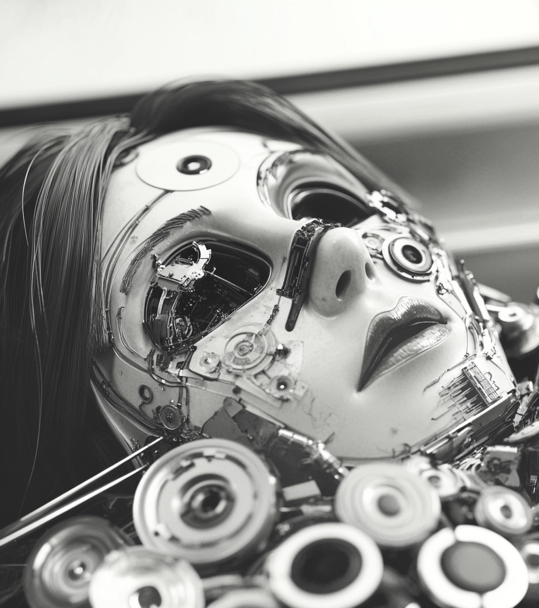   |

---

### Artificial Intelligence involves….  

| | |
|---|---|
| 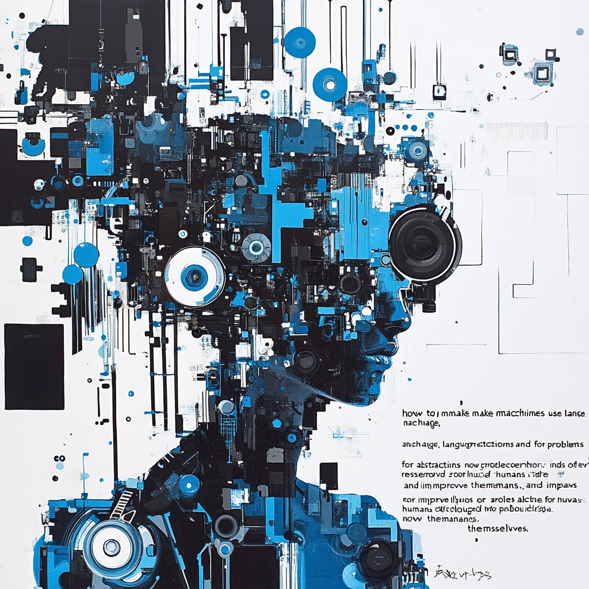    “*how to make machines use language, form abstractions and concepts, solve kinds of problems now reserved for humans, and improve themselves*” (McCarthy et al., 1955)   |  |

---

### An Era of Symbiotic (or Sympoetic***** or Co-intelligent******) Pedagogy?   **Human-to-Human** **Human-to-AI (e.g. GPT)** AI-to-AI (e.g. DeepSeek R1-Zero) **AI to Human**  

| | |
|---|---|
| Human    AI    ***** Donna Haraway (2106) *Staying with the Trouble* ****** Ethan Mollick (2024) *Co-intelligence*   |     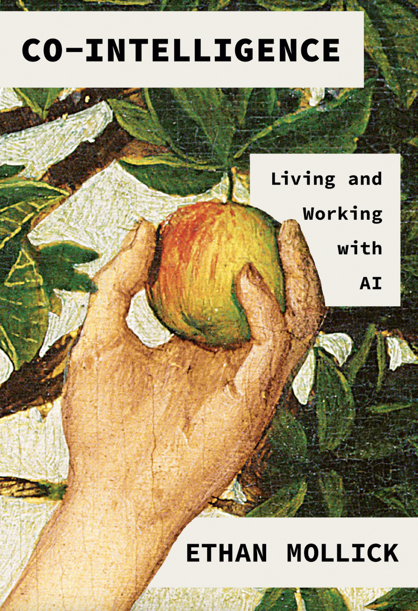   |

---

###   

| | |
|---|---|
| Qwen2.5-Max, “tabula rasa, b&w”, 16:9   |  |

---

###          AI as IT?  Or something else?  

| | |
|---|---|
| 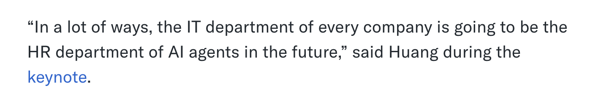   | Yahoo Finance, 2025   |

---

###    Fourth Figure. *Ars brevis* XVIII Century. Palma de Mallorca BP MS998. Digital version Biblioteca Virtual del Patrimonio Bibliográfico. Spain. Ministerio de Educación, Cultura y Deporte.   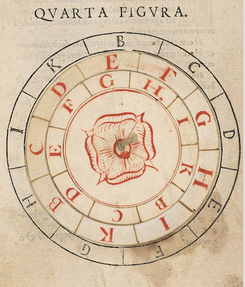  

| | |
|---|---|
| **Proto-Computing in the  ****8****th ****–****13****th **** Centuries**    Al-Khwarizmi - Esposito, John L. , ed. (1999) *The Oxford History of Islam*, Oxford University Press ISBN: 0195107993. ; April 2006   |  |

---

### 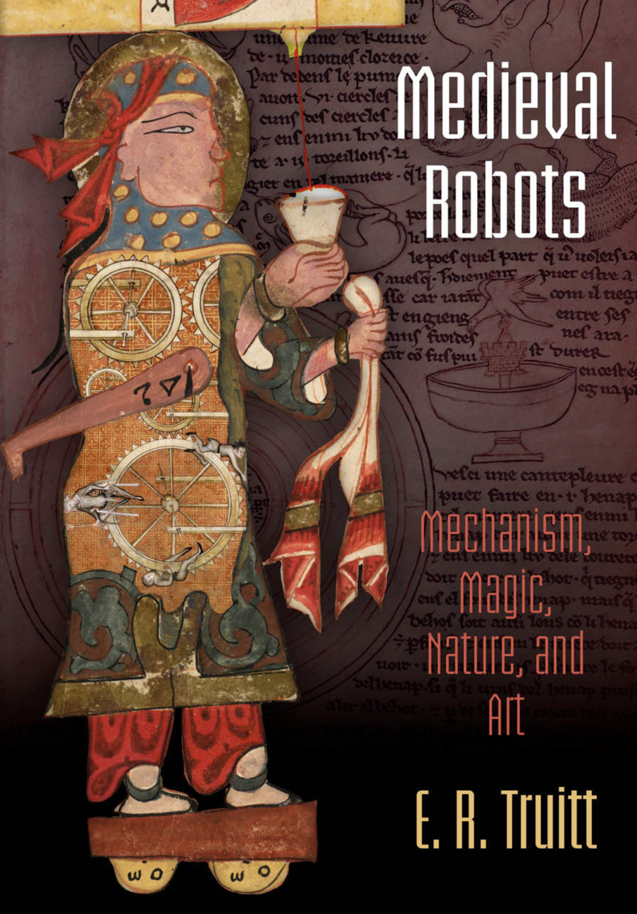   Side-note for the historically minded…  Truitt, E. R. (2015). *Medieval robots: Mechanism, magic, nature, and art*. University of Pennsylvania Press.  

---

### 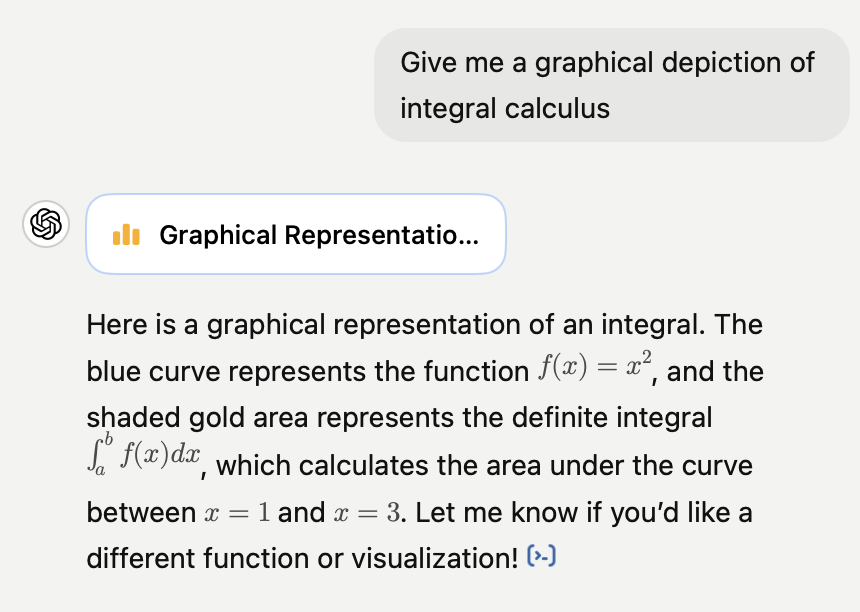   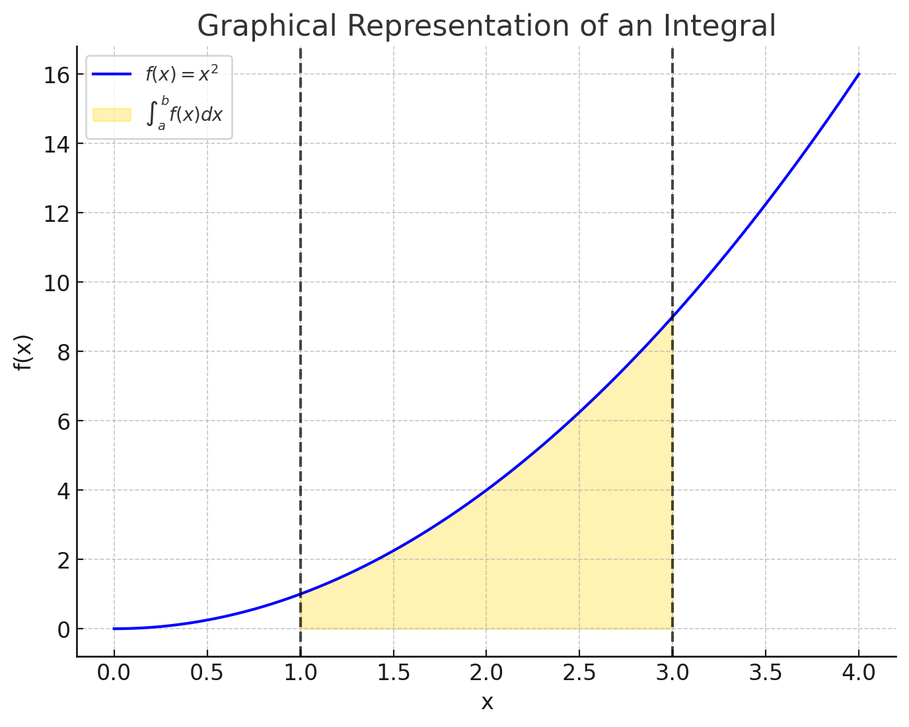  

---

### ‘If AI systems are seen as more reliable or rational than any human expert, able to take the “best possible action,” then it suggests that they should be trusted to make high-stakes decisions in health, education, and criminal justice. When specific algorithmic techniques are the sole focus, it suggests that only continual technical progress matters, with no consideration of the computational cost of those approaches and their far-reaching impacts on a planet under strain.  In contrast, in this book I argue that AI is **neither artificial nor intelligent**. Rather, artificial intelligence is both embodied and material, made from natural resources, fuel, human labor, infrastructures, logistics, histories, and classifications. AI systems are not autonomous, rational, or able to discern anything without extensive, computationally intensive training with large datasets or predefined rules and rewards. In fact, artificial intelligence as we know it depends entirely on a much wider set of political and social structures…. At a fundamental level, AI is **technical and social practices, institutions and infrastructures, politics and culture**. Computational reason and embodied work are deeply interlinked: AI systems both reflect and produce social relations and understandings of the world.’ Crawford, Kate. (2021). *Atlas of AI: Power, Politics, and the Planetary Costs of Artificial Intelligence* (p. 8). Yale University Press.   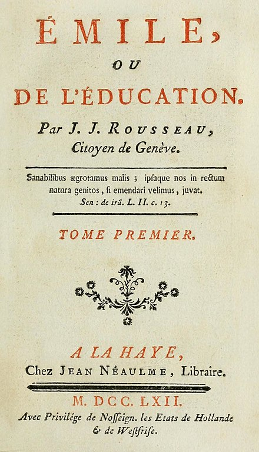  

---

### 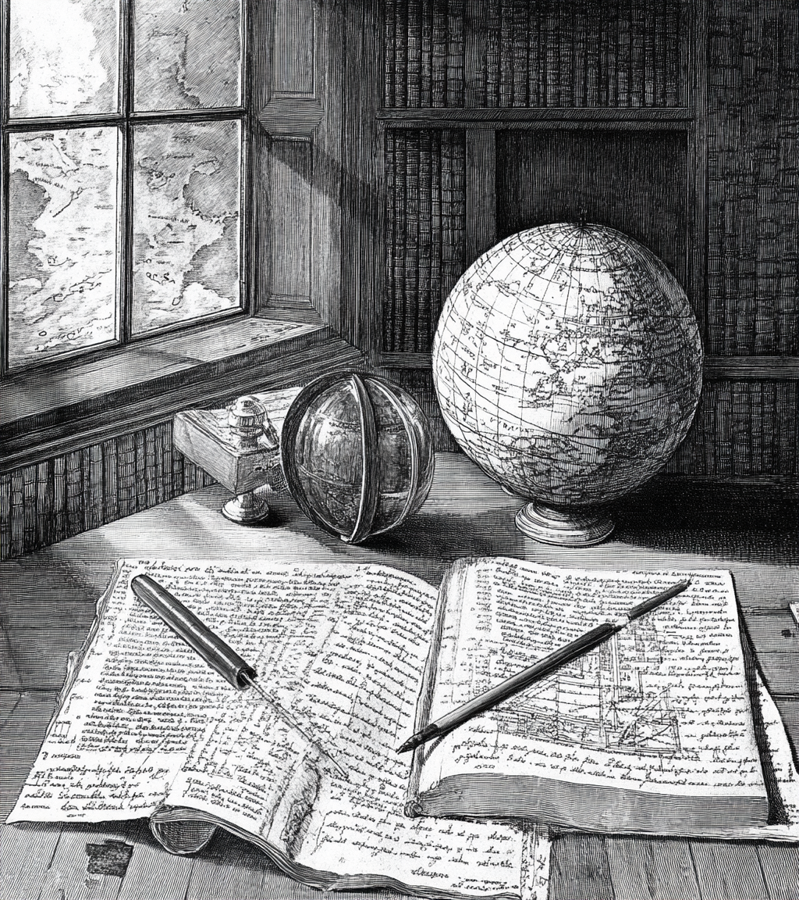   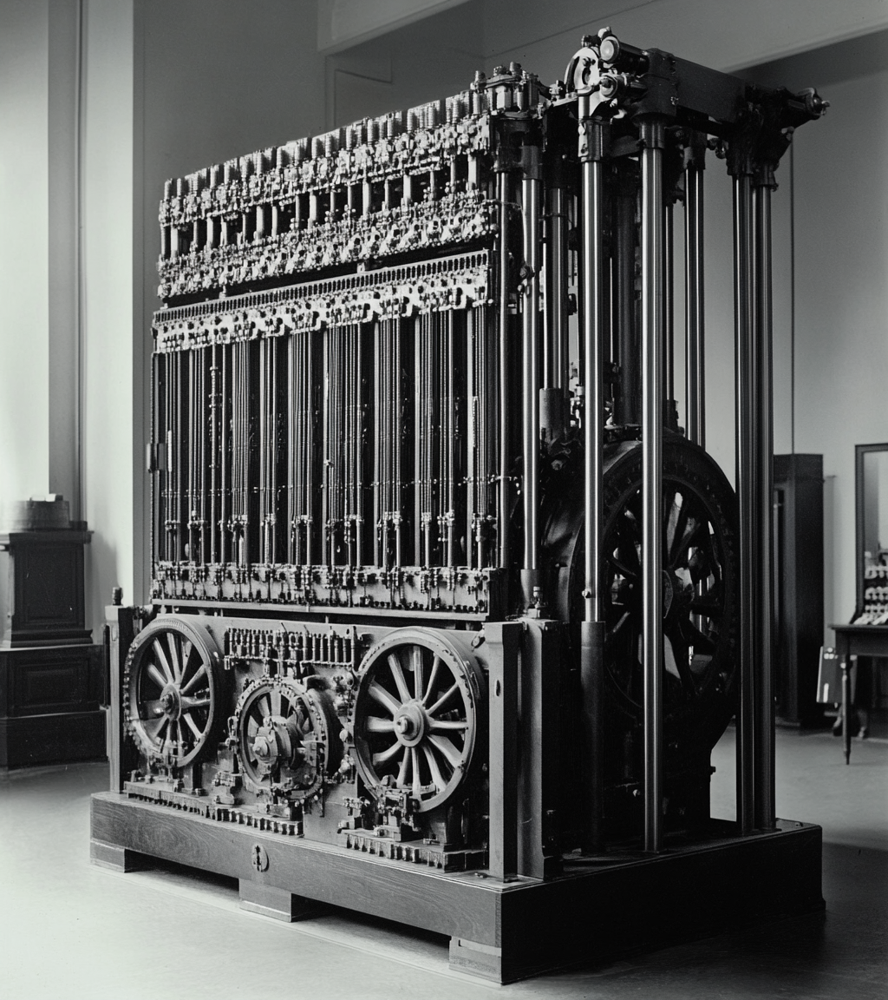  

| | |
|---|---|
| **17th/****18th**** Century** ** – final days of feudalism** ** – computation as *****rational (human)***    **18th/19th Century** ** – first days of industrial capitalism** ** – computation as *****mechanical (machine)***   |  |

---

### 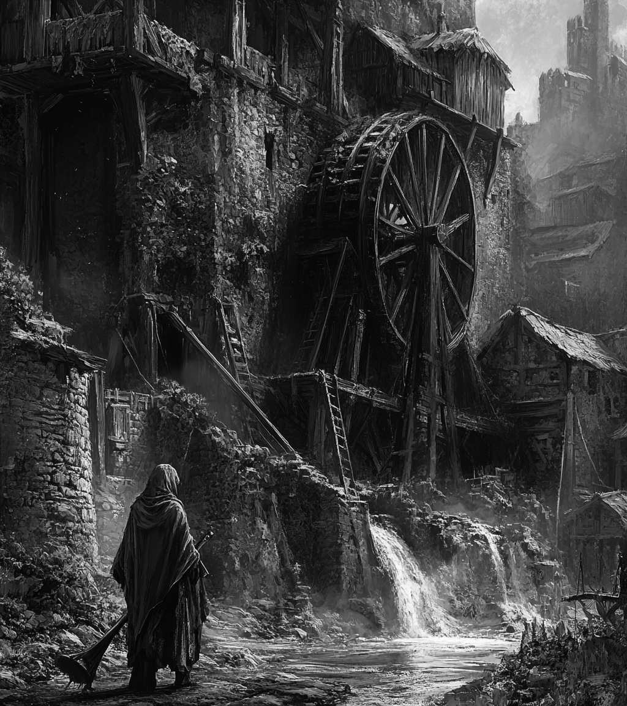   **“The hand-mill gives you society with the feudal lord;**   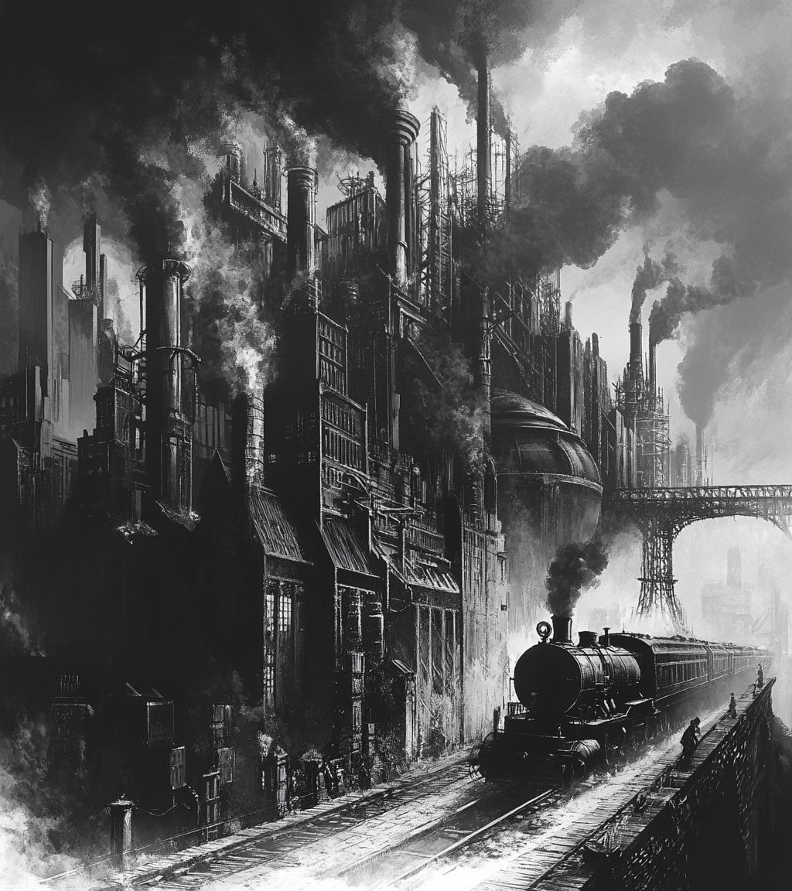   **the steam-mill society with the industrial capitalist.” (Marx, 1847)**  

---

### **17th / 18th Centuries - Dawn of Modernity** Renaissance -> Enlightenment Rationality Mathematics (Descartes, Leibniz, Newton) Science (Bacon, Newton) Philosophy (Descartes, Spinoza, Leibniz) The Birth of the (political) Subject (Luther, Calvin > Descartes, Rousseau) “Calculemus!” (Let us Calculate - Leibniz) - but see Nietzche’s reaction… Proto-Industrialization / Globalization / Colonization Machines: Steam Engine / Jacquard Loom.   **19th / early 20th - Modernity Proper** England as the Factory of the World: High precision mass mechanization The Horror of the machine - Romanticism, Frankenstein, the rise of the Gothic genre 1820s - Luddism, English Socialism 1830s/40s - Babbage, Lovelace, Engels, Marx (Marx cited Babbage - Marxism is partly a response to technology, and the “General Intellect” also looks like AI) Comte: Positivist sociology (society can be scientific)  Darwin: Man is not the centre of things… (but evolution leads an orientation towards history - perfectable or degenerative) Ricouer: “Hermeneutics of Suspicion” (Marx, Nietzsche, Freud) - beyond Descartes: forces of  ideology / will to power / unconscious desire… Fordism / Taylorism   **mid 20th - early 21st - Post/Late Modernity ** Politics and economics: false “sciences” (2 world wars, Great Depression) Paradox: Computation arises out of negative mathematics, 1930s (Godel, Church, Turing): what computation **cannot **do First computers in 2nd world war: differencing engines (Leibniz, Babbage – ChatGPT) - do calculus sums for missile trajectories (gravity, acceleration) Post-war 1950s: AI, but also cybernetics, information theory (Shannon), the Turing test, game theory (Nash, von Neumann) - back to “calculemus”? Markets as perfect computers: neoliberalism as epistemology.  Post-fordism, immaterial / flexibilized / cognitive labor,  Counter-narratives: Cultural Marxism, existentialism, poststructuralism, “ends” talk (End of Man - Foucault; end of History - Fukuyama; end of the grand narrative - Lyotard) Post-Enlightenment disenchantment AI Winter / Spring / glorious Summer? Transhumanism, return to Enlightenment, or enshittification (Doctorow)?  

---

### Looking ahead…  

| | |
|---|---|
| What **fundamentals** makes for AI / Machine Learning / Deep Learning / Neural network? Calculus (17th century – Leibniz, Newton) Probability [think “stochastic parrots”] (18th/19th century – Euler, Gauss, Laplanche Fourier) Linear algebra (19th century – James John Sylvester) Markov Models (very early 20th century – Andrej Markov)   |  |

---

### And a bold proposition…  

| | |
|---|---|
| All the **mathematics** for AI in 2025 was developed by the end of the 19th century (with applications, like Markov models, in 1906/1913) Are the last 125 years just **hardware**, **networks** & **data **(see LeCun 2021 - who doesn’t (quite) say this)? Is our sense of **modernity **just the long shadow cast by the Enlightenment (17th / 18th century)?   |  |

---

